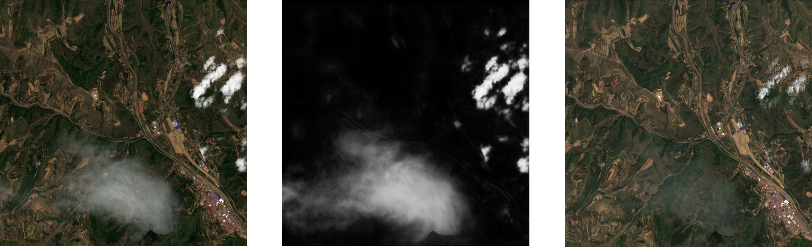
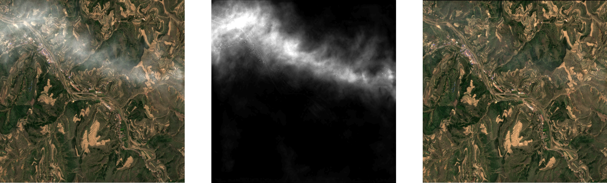
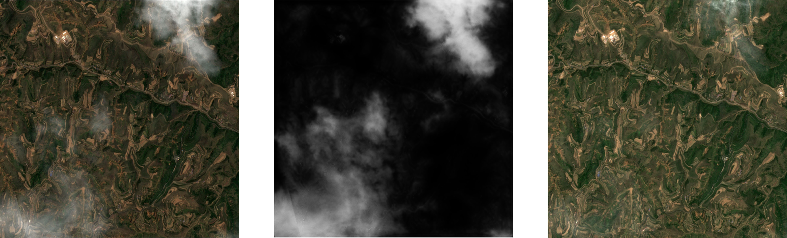

<h1 align="center">SCM-CNN: Cloud-matting and Cloud-removal</h1>

## 🔶Description:
A method for thin cloud removal from a single image of Sentinel-2 was developed, which can effectively perform cloud segmentation and evaluate cloud thickness. We use the Image-Matting method to cloud removal and enhance the remote sensing image.


# Sample Demo:
## Demo 1:
<div align="center"></div>

## Demo 2:
<div align="center"></div>

## Demo 3:
<div align="center"></div>


# How to use？
## Train
```shell
python train.py --trainDir ./data/train_dataset --testDir ./data/test_dataset --saveDir ./modelSave
```
**For more details please refer to` train.get_args()`** 😲
## Prediction
If you want to infer an entire remote sensing image use (large image):
```shell
python modelpre --Image_path "Image path" --ckpt "ckpt path" --saveDir "Save path" 
```
If you want to infer on a set of sliced images use (small images):
```shell
python modelpre --preDir "Image Dir" --ckpt "ckpt path" --saveDir "Save path"
```


## Cloud-Matting Dataset
[](https://doi.org/10.5281/zenodo.7188292)

## Weight

Tentatively publish the "ckpt_train.pth" for testing (small dataset 40 epochs training). 

[GoogleDrive:ckpt_train.pth](https://drive.google.com/file/d/1FUBziIanu7heDsYC90f4mkuzG5Ckog2a/view?usp=share_link)

Expect the paper to go well. When the paper is accepted, the authors will publish the converged weights.

## CONTACT US

Contact me if you have any questions about the code and its execution.

E-mail: mrwurenzhe@gmail.com


## 📜 Citations

At this point in time, this is simply a placeholder.

## Acknowledge
The network used in this method mainly draws lessons from Qin X's [U2Net](https://github.com/xuebinqin/U-2-Net). This network has small arithmetic power and excellent results, which provides a great convenience for our experiments. We would like to express our sincere gratitude.
